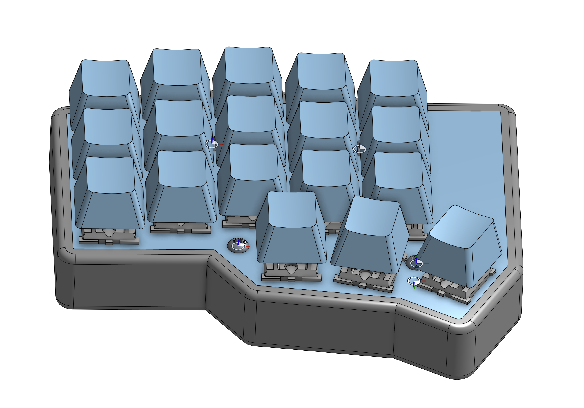
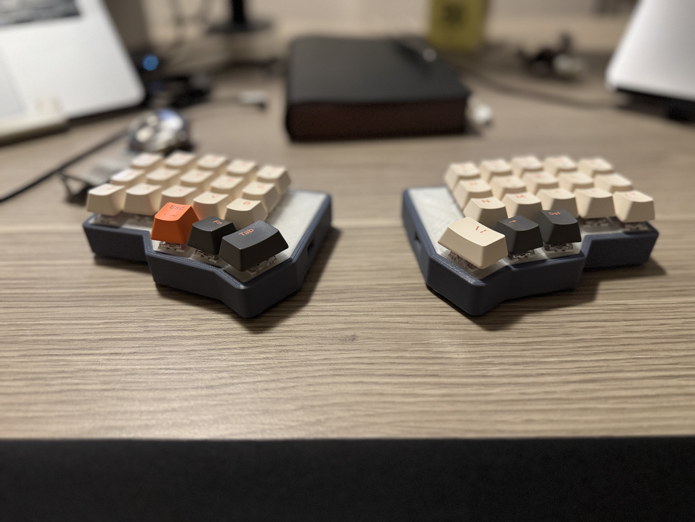

# Hornet
Hornet keyboard build instructions

## Documentation Progress
[ ] Complete steps 
[ ] Deep dive into process
[ ] Update Requirements
[ ] Add more Pictures
[ ] Add in depth instructions

## V2 Progress/ideas
[ ] better feet(rubber ones)
[ ] better switch(it's hard to reach)
[ ] thinner case
[ ] better key switches
[ ] lower profile keys
[ ] possibly use a pcb
[ ] tenting feet
[ ] move mcu closer to the edge of the case
[ ] add e ink display
[ ] add rotary encoder?
[ ] add analog for mouse

## Preface
This keyboard was the first self designed and implemented keyboard that's been my daily driver for the last two years. I'm currently in the process of creating the second version that should include a few improvements over the original. 

- the keyboard was built from a cheap generic mechanical keyboard bought on sale.
- generic MX cherry chinese knock off switches are used
- cheap low power controllers are used
- runs on battery power 
- hand-wired
- the keyboard firmware is built using ZMK

## Requirements:
1. Print the case and plate
2. 2 x 400-1200mAh batteries
3. 2 x XIAO nRF52840
[nRF52840](https://www.google.com/search?q=seeeduino%20nrf52840&oq=seeduino%20nrf&sourceid=chrome&ie=UTF-8)
4. 2 x slide switches
5. There are a few other things like wires and diodes that you need to buy

## Pictures

## Onshape Link
[Hornet]( https://cad.onshape.com/documents/1046e76c0b6bfc0d994d6801/w/c817a671344719c27eeb4cdd/e/564946c69633315976b61c4a?renderMode=0&uiState=6803defccd103a40dd717e56 )

## Instructions
[Hand-wire Instructions](https://johannes-jansson.github.io/projects/2018/07/23/hand-wiring-lets-split.html)
